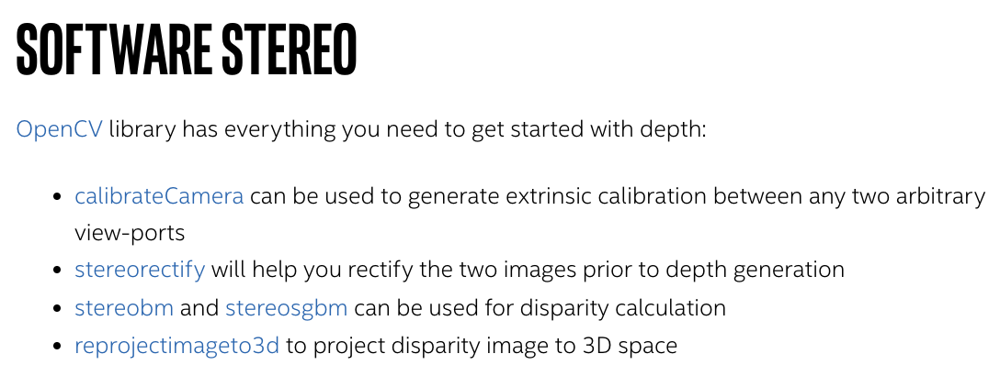

### Underwater Stereo Imaging Projects

**MARIS (Marine Autonomous Robotics for InterventionS) Project, RIMLab**
[Project Homepage](https://rimlab.ce.unipr.it/Maris.php#MarisGarda)
Rizzini et al 2015. Investigation of Vision-based Underwater Object Detection with Multiple Datasets. 
Object detection as opposed to depth recovery - but initial processing might contain more what we're looking for.  For more information on the MARIS project see the [RIMLab project page](https://rimlab.ce.unipr.it/Maris.php#MarisGarda) or the paper. Sections of most relevance are _**Image Pre-Processing Before Object Detection**_ and _**Dataset Acquisition**_.

*Software/Code*
Maris Vision - collection of ROS packages used for MARIS project. The stereo vision system is designed for detection, pose estimation, and grasp planning for object manipulation. 
[GitHub Repo](https://github.com/dlr1516/maris_vision)

*Datasets*
Portofino 2014 - a half an hour of image frame pairs. Provided "AS IS". Contains a README and 3 .tar.xz files. See Portofino folder in this repo.

Garda 2013 - raw dataset in rosbag format. 
[Source](https://www.ce.unipr.it/~rizzini/maris_acquisition_20130714/)

---

**Berman, Levy, Avidan, Treibitz 2020. Underwater Single Image Color Restoration Using Haze-Lines and a New Quantitative Dataset.** [arxiv](https://arxiv.org/pdf/1811.01343.pdf)

Features dataset and code. See Transmission section below for alternative to depth from disparity (works for single images). 

*Code*
[Underwater Color Restoration](https://github.com/danaberman/underwater-hl) Dehazing, depth via transmission and image enhancement. Evaluation code for image enhancement. All in MATLAB. 

*Dataset*
SQUID - Stereo Quantitative Underwater Image Dataset. Site comes with comparison of standard algorithms and downloads. Ground truth based on depth from disparity using Agisoft, [EpicFlow Code](https://github.com/ZikeYan/epic-flow), [EpicFlow Paper via arxiv](https://arxiv.org/pdf/1501.02565.pdf). 

Multiple sites, tropical water. RAW images, TIF files, camera calibration, and distance maps. [Source](https://csms.haifa.ac.il/profiles/tTreibitz/datasets/ambient_forwardlooking/index.html), [Source - Alternate](https://zenodo.org/record/5744037)

[Visual-Inertial dataset](https://www.kaggle.com/datasets/viseaonlab/flsea-vi). 

---

**Depth from Stereo Tutorial, with OpenCV - Andreas Jakl**

Features code and sample images. 

For OpenCV stereo libraries, see: 

[GitHub Repo](https://github.com/andijakl/python-depthmaps)
[Tutorial Series Start](https://www.andreasjakl.com/easily-create-depth-maps-with-smartphone-ar-part-1/)

---

**Real-Time Stereo**

Did not use during this project because of compilation issues on CUDA 12 (runs CUDA 8 and 9). CPU and GPU implementations of Semi-Global Stereo Matching (highly improved versions). DEFINITELY worth further investigation, especially in the name of speed. 

[GitHub Repo](https://github.com/kbatsos/Real-Time-Stereo/tree/master)

---

**Li et al 2015. Simultaneous Video Defogging and Stereo Reconstruction.** 

Does not provide data or code - but describes a method for image defogging to gain a sense of depth, similar to Berman et at al 2020. 

 > **Key features**
 > 1. Improve the photo-consistency term to incorporate the scattering effect by modeling appearance change due to fog
 > 2. Compute fog transmission at each pixel from scene depth and estimated fog density.
 > 3. Incorporate a strong prior on fog transmission - impose matting Laplacian constraint - fog transmission can be directly computed from depth
 > 4. Incorporate pairwise depth ordering constraint

---

**Yamaguchi, McAllester, and Urtasun 2014. Efficient Joint Segmentation, Occlusion Labeling, Stereo and Flow Estimation.** 

Comes with code. Yield depth as well as segmentation, occlusion boundaries. Requires two frames - motion and stereo. Not specifically for underwater. Was not used during this project, but could be an interesting next step! 

Meeting the KITTI benchmarks, this algorithm can recover
1. image segmentation
2. dense depth estimate
3. boundary labels (i.e. occlusion boundaries)
from a static scene with two frames of a stereo pair. 

[Project Homepage](https://home.ttic.edu/~dmcallester/SPS/index.html)

## Stereo Matching

Using OpenCV

**StereoBM vs. StereoSGBM**
(Block Matching vs. Semi-Global Block Matching)

StereoBM - computes stereo correspondences using the block matching algorithm, introduced an contributed to OpenCV by K. Konolige. [Docs](https://docs.opencv.org/4.x/d9/dba/classcv_1_1StereoBM.html#aa1659733652473662da8e2e2a6dd83fa), [Docs - Alt](https://vovkos.github.io/doxyrest-showcase/opencv/sphinx_rtd_theme/class_cv_StereoBM.html)
[StereoBM Parameters](https://stackoverflow.com/questions/22630356/documentation-of-cvstereobmstate-for-disparity-calculation-with-cvstereobm)

Stereo SGBM - implements the modified H. Hirschmuller algorithm that differs from the original. [Docs](https://docs.opencv.org/4.x/d2/d85/classcv_1_1StereoSGBM.html), [Docs - Alt](https://vovkos.github.io/doxyrest-showcase/opencv/sphinx_rtd_theme/class_cv_StereoSGBM.html#)

[Stereo Match - OpenCV-Python Sample](https://github.com/opencv/opencv/blob/master/samples/python/stereo_match.py)
[Disparity from Stereo Images - OpenCV Tutorial](https://docs.opencv.org/4.x/dd/d53/tutorial_py_depthmap.html)
[Disparity from Stereo - ROS stereo_image_proc Tutorial](https://wiki.ros.org/stereo_image_proc/Tutorials/ChoosingGoodStereoParameters)

## Transmission
As an alternative for depth from disparity in stereo systems, Randall et al generated a transmission map from single underwater images. 

From Berman et al that does a better explanation of how transmission maps are used: 

> The transmission is the fraction of the scene's radiance that reaches the camera, and is related to the distance via the attenuation coefficient. 
> 
> Under water, where the assumption of wavelength independent attenuation does not hold, there are **theoretically three unknown transmission values per pixel**, one per channel, yielding six unknowns with only three measurements. However, the color-dependent transmission is related to the distance via the attenuation coefficients. Based on this relation we reduce the problem to estimation of four unknowns per pixel as before, with two new global parameters, the ratios between the attenuation coefficients of the color channels. We estimate these parameters using an existing library of water types, and based on the color distribution of the image after correction. We utilize the fact that using a wrong water type leads to distorted colors. Our results demonstrate a successful single image restoration of underwater scenes using a comprehensive physical image formation model. Thus, we are able to recover more complex 3D scenes than previous methods and, in addition, estimate the optical water type. Fig. 1 depicts the proposed method.