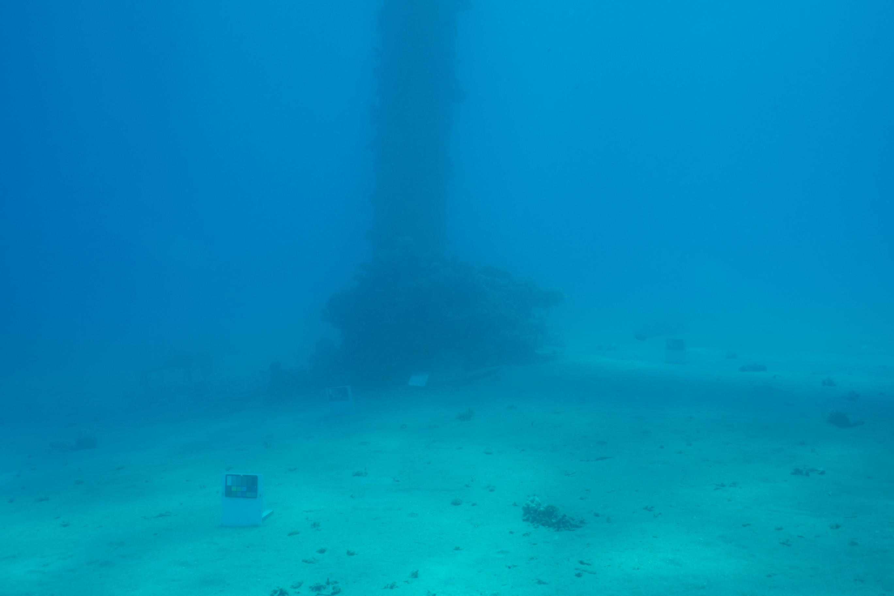
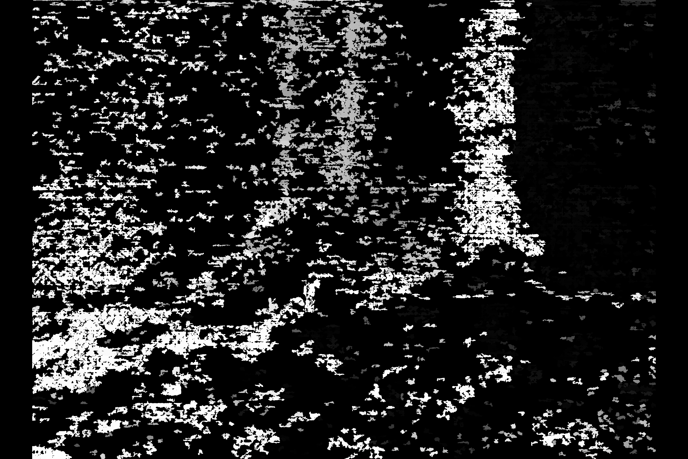

# Depth Recovery from Stereo on Remotely Operated Vehicles

|  |  |
| -- | -- |
| *From Katzaa Dataset.* | *Image after run through stereo disparity code.* |

Information from summer '23 research project on depth-recovery from stereo on underwater ROVs. Using ZED camera, and a variety of depth-recovery methods. 

## What's in this repository? 
#### `ZED/Meshes`
A few test meshes of 3D point clouds made with the ZED camera.

#### `code/`
Code run on ZED and to process images used during the project - on the simpler side but still effective! 

#### `images/`
All images used in these files - containing some samples of dataset imagery and code run during the project. 
 - `Katzaa-LR/` include the images from the SQUID dataset. 
 - `results.../` folders include disparity results from the squid dataset - with the number associated with results being the disparity feature minimum pixel size (a lower number corresponds to allowing smaller 'features' to potentially be detected, and more potential artifacts to influence the output). 
 - `depth-tut/` contains image (processed and unprocessed) not from underwater sets that were used to understand and test the code from the AR tutorials. 
 - `underwater-hl/` contains enhanced images and transmission maps as run from the Treibitz underwater image enhancement MATLAB code. 

#### `Calibration.md`
Calibration resources that could be helpful in future. For ZED-specific calibration information, see `WorkingWithZED2.md`

#### `DataCode.md`
Links and descriptions of existing stereo projects that (mostly) include datasets and code to be implemented - see project description on this page (`README.md`) for which ones and how they were implemented.  Includes information on **Stereo Matching** and **Transmission**, as used in OpenCV and Berman et al, respectively. 

#### `NEWSetup.md`
A description of all the steps to equip the software of the loaner computer for this project. 

#### `README.md`
The file you are looking at right now! A summary of the **resources** contained and a **project summary**. 

#### `WorkingWithZED2.md`
Instructions on working with the ZED2 camera in relation to running the **ROS node**, published and subscribed topics, and **calibration** information. Links and references to relevant Stereolabs documentation on the ZED2.

---

## Project Summary

From the Robust Field Autonomy Lab’s site: “Recent work has considered sensing tasks motivated by underwater surveillance and inspection applications, autonomous exploration under sparse and noisy data, and path planning with multiple objectives, unreliable sensors, and imprecise maps.” 

The BlueROVs make use of sonar imaging techniques to detect obstacles and simultaneously plan its path to create an information dense map that balances location uncertainty and minimizing time of exploration. Stereo cameras as an addition to the vehicles would provide for information-dense maps where more information could be yielded - apart from just depth, future work could have material characteristics extracted from the stereo input.

***Setup and ZED***

The setup went from the process of using the ZED cameras, which were bought to integrate with the lab's existing BlueROV setup, to be used to produce the stereo images. The ZED camera provides a variety of raw and augmented topics published via ROS (which integrates with the existing setup) and comes with an SDK to further adjust settings and interact with the camera. 
1. Distinguishing onboard ZED processes vs. what needs to be run on the Jetson Nano
2. Running the appropriate commands and utilizing RViz

More specifics can be found in the `WorkingWithZED2.md` document. `code/depth.py` is a sample code from Stereolabs which allows for depth creation from the ZED Node. 

***Other Stereo Depth Projects and Datasets***

From there, I focused on what algorithms could be used to recover depth information. This began as a literature review and research into other existing underwater robotics setups which utilize stereo vision. 
1. The MARIS Project and work of the RIMLab
2. The SQUID Dataset and work of the Treibitz Lab

In `DataCode.md`, you can find out more about these projects under the first two project descriptions. The work of the Treibitz Lab became a central part of this process as their dataset became was central to testing the available depth and disparity codes. 

If there was more time - using the image enhancement code from Berman et al on the stereo images and then apply disparity could potentially provide clearer and more accurate depth and disparity maps and would be worth further investigation. 

***Stereo Methods and Review of Literature***

There were also distinct methods of utilizing stereo imagery in robotics applications, and further different ways of getting depth information from said methods. Image enhancement often went along hand-in-hand with depth estimation, because underwater video is subject to turbid water conditions, haze, and fogging that make it harder to extract features and perform other standard techniques used in terra firma robotics applications. 
1. Image enhancement - color, dehazing
2. Transmission maps for depth
3. Depth from Disparity
4. Depth from Motion (Parallax)

Some suggested reading on a few of these topics (most available via Google Scholar or IEEEXplore): 

 - Li et al 2015. Simultaneous Video Defogging and Stereo Reconstruction.
 - Skinner et al 2019. UWStereoNet: Unsupervised Learning for Depth Estimation and Color Correction of Underwater Stereo Imagery.
 - Rizzini et al. Investigation of Vision-based Underwater Object Detection with Multiple Datasets.
 - Wong et al 2022. Underwater Depth Calibration Using a Commercial Depth Camera.
 - Roser et al 2014. Simultaneous underwater visibility assessment, enhancement, and improved stereo.
 - Rossi et al 2018. Real-Time Underwater StereoFusion. [MDPI][https://www.mdpi.com/1424-8220/18/11/3936/htm]

***Processing Images for Depth***

In the final weeks of this project, these some of the these algorithms were applied to the SQUID dataset made available by Berman et al at the LABNAME lab. Output images were produced by running the Underwater-hl MATLAB code made available on GitHub to produce enhanced, dehazed images and transmission maps (which can be used to estimate depth), using depth tutorials to run OpenCV's disparity algorithms and stereo matching. 

The images at the top of this page display the result of the OpenCV disparity processing, and running the code from this AR tutorial. `code/disparity.py` was run on `images/Katzaa-LR` under certain different parameters, producing the results found in `images/results.../`
